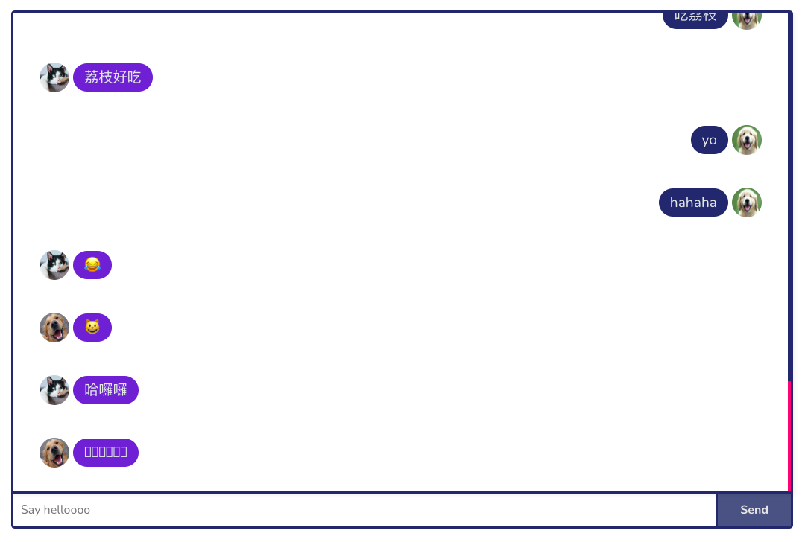

# glance - simplified work space

## Description - why

I love use all sorts of management tools, simply because I am kinda obsessed with the beauty of each tool has its core idea of how to solve problems.

For me, I have encountered a problem of organizing files last year, the company I worked for was using google products, so when I was a new joiner, I hardly found the "right" docs, not to mention majority of docs were outdated, so I was thinking what if we can have a light weight tool to help people manage work space?

This project is inspired by #Netninja and #Fireship, thank you for creating such great course, I've learnt a lot from you. You can find their tutorials on Youtube channel or from their website.

## Project Description

Tech scope:

  

This project is inspired by Netninja's [React course](https://www.udemy.com/course/build-web-apps-with-react-firebase/), I managed to modify layout, style and add additional features like text editor, project status .etc, more to come!

## Features:

### Authentication

- By using firebase auth, this allow user to sign up and login.
  
- User can click login button to switch page from signup to login
- User needs to upload a photo, if size of the photo is over 100kb, it will show warning.
  
- Login UI
  

### Dashboard

- Dashboard contains a doughnut chart, project list and a load more button that allow user to load more project.
- Projects are sorted by due date, the nearest date will be shown first.
  

### Sidebar

- Active background color based on its current page
- User photo and the display name
  

### Add project

- Here is a from which allow user to add subject, content, due date, stakeholder and assignees.
- I use tinymce as text editor.
- Storing data in localstorage if user accidentally closes browser or visits other page.
- I spent quite a lot of time to figure out how to store content in localstorage.
- Once clicking submit, project will be shown on the dashboard.
  

### Chatroom

- Chatroom was inspired by #Fireship, it was really fun to implement this in my project.
- Having a chatroom for people to connect might be a good idea, but I am planning to implement more feature in the future,such like metion, text editor .etc.
  

### Budget planner

- This is a simple budget planner, use can change total budget and add budget categories.
- Once use adds expense, it will render on the dashboard so user can track every expense.
  
