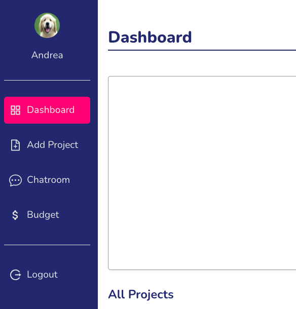

# glance - simplified work space

## Description - why

I love use all sorts of management tools, simply because I am kinda obsessed with the beauty of each tool has its core idea of how to solve problems.

For me, I have encountered a problem of organizing files last year, the company I worked for was using google products, so when I was a new joiner, I hardly found the "right" docs, not to mention majority of docs were outdated, so I was thinking what if we can have a light weight tool to help people manage work space?

This project is inspired by #Netninja and #Fireship, thank you for creating such great course, I've learnt a lot from you. You can find their tutorials on Youtube channel or from their website.

## Project Description

Tech stack:

  

Third party package:

1. [react-select](https://react-select.com/home)
2. [tinyMCE](https://www.tiny.cloud/docs/tinymce/6/)
3. [scrollReaveal](https://scrollrevealjs.org/)
4. [react-chartjs-2](https://react-chartjs-2.js.org/)

## Features

### 1. Authentication

- By using firebase auth, this allow user to sign up and login.
  

- Landing page with animation.
  
- User can click login button to switch page from signup to login
- User needs to upload a photo, if size of the photo is over 100kb, it will show warning.
  
- Login UI, user can click signup to switch page for signing up.
  

### 2. Dashboard

- Dashboard contains a doughnut chart, project list and a load more button.
- Projects are sorted by due date, the nearest date will be shown first.
  

### 3. Sidebar

- Active background color based on its current page
- User photo and the display name
  

### 4. Add project

- Here is a from which allow user to add subject, content, due date, stakeholder and assignees.
- I use tinymce as text editor.
- Storing data in localstorage one user click save.
- user can restore content by clicking restore.
- Once clicking submit, project will be shown on the dashboard and the page will be redirect to dashboard.
  

### 5. Budget planner

- This is a simple budget planner, user can change total budget accordingly.
- Once user adds expense, it will render on the dashboard and current page so the user can track every expense.
- All categories are listed out, including amount and for the duplicated category, it will sum up automatically, if the amount is over $ 1500, font color will be yellow.
  
- User can only create project first and add budget to the project belongs to user, only user submit budget to relevant project, it will be shown when use click the project on dashboard.
  
