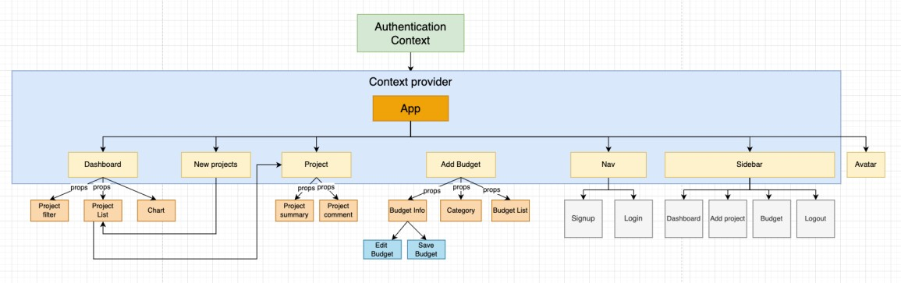
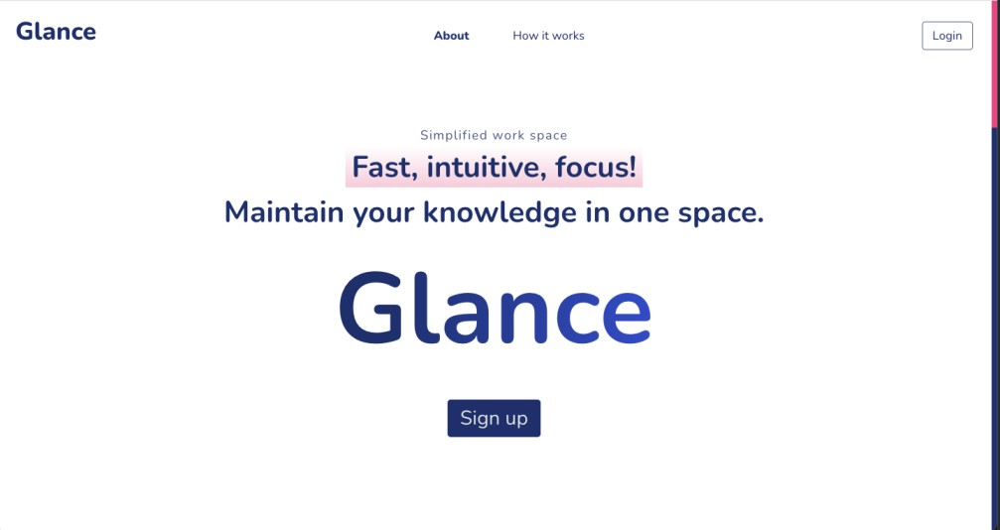
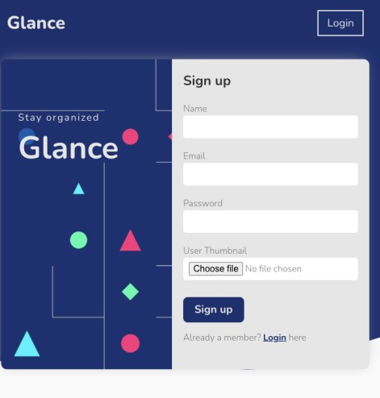
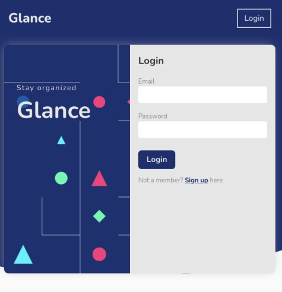
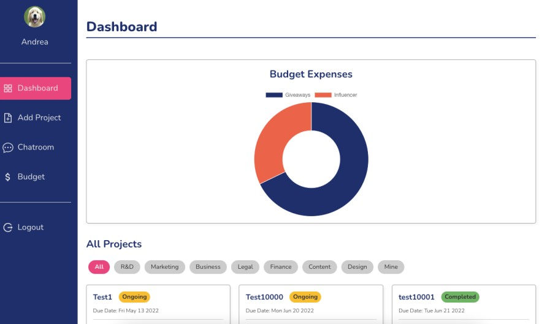
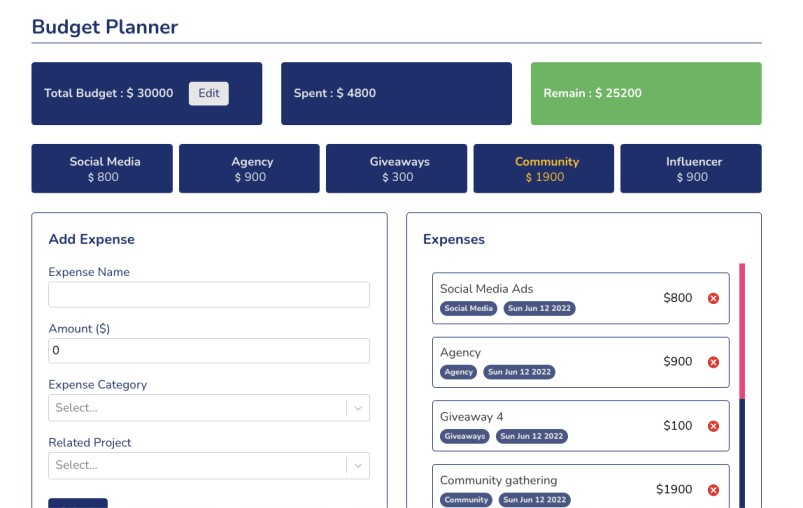
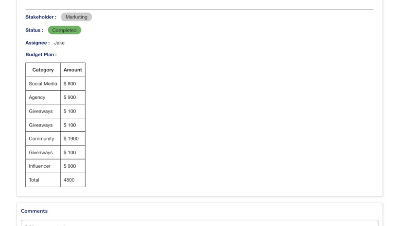
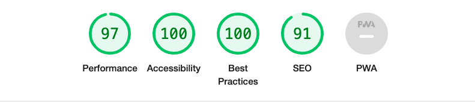

# glance - simplified work space

## Table of contents

- [Description - why](#description---why)
- [Project Description](#project-description)
  - [Demo](#demo)
  - [Tech Stack](#tech-stack)
- [Features](#features)
  - [Authentication](#1-authentication)
  - [Dashboard](#2-dashboard)
  - [Add project](#3-add-project)
  - [Budget Planner](#4-budget-planner)
- [Obstacles](#obstacles)
- [Future Update](#future-update)

## Why

I love use all sorts of management tools, simply because I am kinda obsessed with the beauty of each tool has its core idea of how to solve problems.

When I was in my previous company as a marker, we always stored our projects by using gxxxxe drive, we didn't have a space for marketing specifically (something like confluence page, which each department can build its own knowledge base), therefore, there were lots of scattered documents, let alone to update these files, as for budget planning, we ended up using different sheet to maintain our budget, ever since then the idea of building my own work space has been planted in my mind.

## Project Description

### Demo

- [Live Demo](https://glance-simple-work-space.web.app/)
- [Login with test account](https://glance-simple-work-space.web.app/login)

### Component Tree

### Tech stack:

<!--     -->

| Skill            | Description                                                                  |
| :--------------- | :--------------------------------------------------------------------------- |
| React Hook       | SPA with function components                                                 |
| Context API      | For authentication                                                           |
| React Router     | SPA routing                                                                  |
| style-components | Build custom components by writing CSS in JS, easy to build scope for styles |
| Git              | Version control                                                              |
| webpack          | Module bundler                                                               |
| Babel            | Compiler                                                                     |
| Firebase         | Firestore: Add, update and delete collection / document                      |
|                  | Firebase Authentication: Sign up, login and logout                           |

Third party libraries:

1. [react-select](https://react-select.com/home)
2. [tinyMCE](https://www.tiny.cloud/docs/tinymce/6/)
3. [scrollReaveal](https://scrollrevealjs.org/)
4. [react-chartjs-2](https://react-chartjs-2.js.org/)

## Features

### 1. Authentication

- Create global context for user authentication, onece user signup, login or logout, it would trigger signup custom hooks (signup, login and logout) to connect with firebase authentication.

  - Signup : After clicking signup, by using firebase auth "createUserWithEmailAndPassword" and "updateProfile" to create user data in firestore and uploading image in storage.
  - Login : After entering email and password, it will trigger login custom hook and connect with firebase auth "signInWithEmailAndPassword" to check if email and password are correct.
  - Logout: Triggering logout custom hook to update user status from online to offline and redirect user to login page.
  <!--  -->

<!-- - Landing page with animation. -->

  <!--  -->

<!-- - User can click login button to switch page from signup to login.
- User needs to upload a photo, if size of the photo is over 100kb, it will show warning. -->
  <!--  -->
<!-- - Login UI, user can click signup to switch page for signing up. -->
  <!--  -->

### 2. Dashboard

- Dashboard contains a doughnut chart, project list and a load more button when there are more then 3 projects.
- Projects are sorted by due date, the nearest date will be shown first.
- Doughnut chart will be rerendered once user adds or deletes new expense.

  <!--  -->

### 3. Add project

- By submitting project, custom firebase hook will be triggered and added project details in firestore, user will be redirected to dashboard and project will be rendered in the same time.

  <!--  -->

### 4. Budget planner

- By submitting budget, custom firebase hook will be triggered and added budget details in firestore, expense detail will be shown immediately on the left side.
- Expense category and amount will be shown on the top.
- Spent and remain budget will be deducted automatically based on the total budget.

  <!--  -->
  <!--  -->

## Learning / Faild case

### Implement saving and restoring texts in localstorage for tinyMCE text editor.

- Idea behind :

  - Make it like other input fields, creating keys when page starts rendering and storing data after user typing / selecting any values.

- Outcome:

  - This approach only worked for normal input and select field.

- Solution :
  - Need to Create 2 buttons, one for saving texts in localstorage, another for restoring texts from localstorage.
  - This approach wasn't the best one, since user needs to "click" to save and restore, it would be bad for user experience.

### Implement filter functionality

- Filter was one of the features that took me for a while to figure out, initially I wasn't sure where should I put my states, so I've searched few similar features as references.

- Learning points:
  - Component should be (not limited) as clean as possible, for filter, I shouldn't put all the logics in this component, it only needs to check which tag is active.
  - It would be better to put all the logics in dashboard as it has filter component, and pass data as props.
  - Destructure props in filter component.

## Performance optimization:

First time checking app performance (website) by Lighthouse, the scores were:

- Performace: 63
- Accessibility: 89
- SEO: 82

Lists that can be optimized:

Performance:

- [x] Time to interactive: 2.5s
- [x] Speed index: 2.3s
- [x] Total Blocking time: 1,610ms

Accessibility:

- [x] Link don't have a discernible name
  - Adding `aria-label=""` to Github and Linkedin links.
- [x] Lists do not contain only `<li>` element & script supporting elements
  - Adding `<li>` before 2 `<a>` links in the footer.

SEO:

- [x] Document doesn't have meta description
  - Adding `<meta name="description" content="">` in index.html

Best practice:

- [x] Browser errors were logged to the console
  - Adding `type="text/babel"` in `<script>`

Scores after fixing :

## Future update

1. User can reply in the comment section.
2. Single chatroom
3. Mention functionality and notification.
4. Fix text editor for saving and restoring content automatically without clicking.
