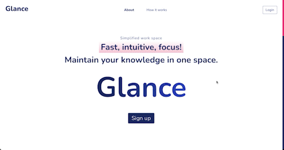
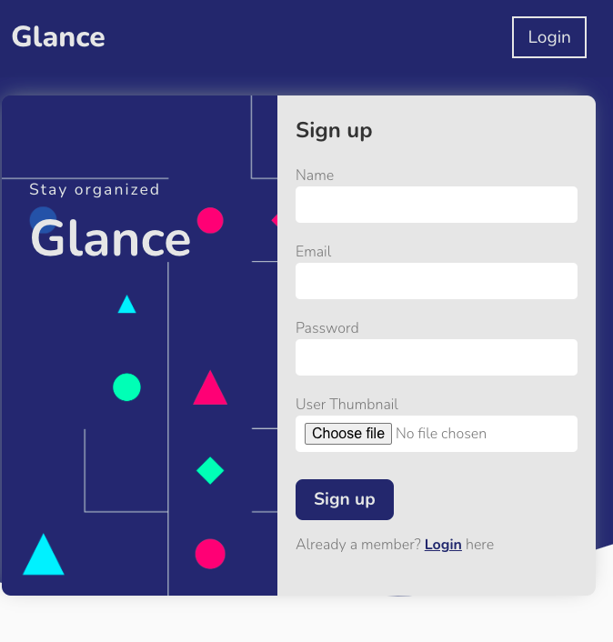
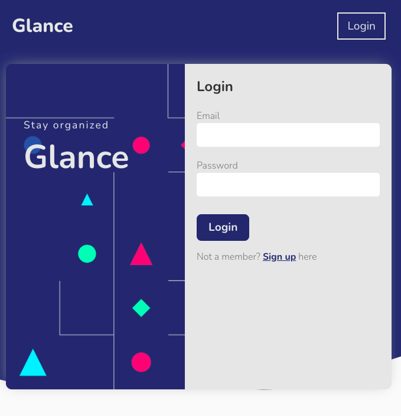
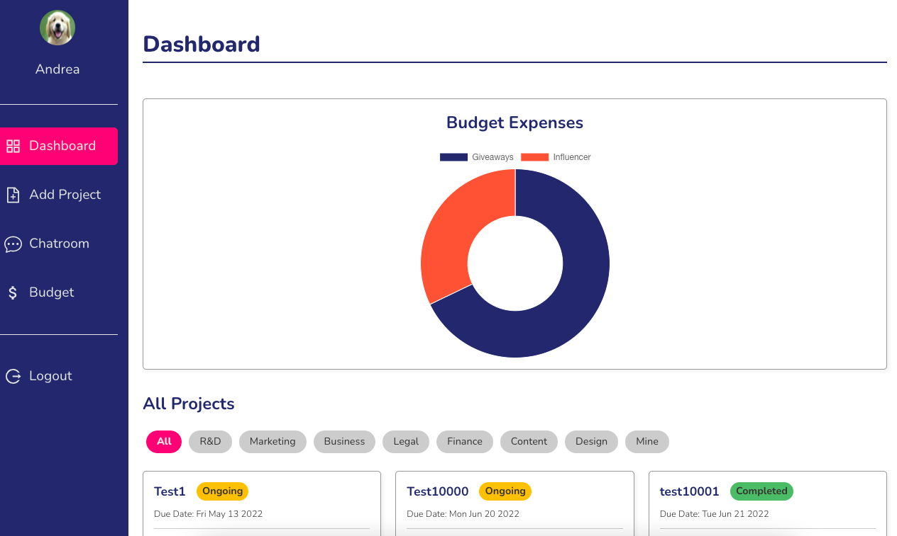
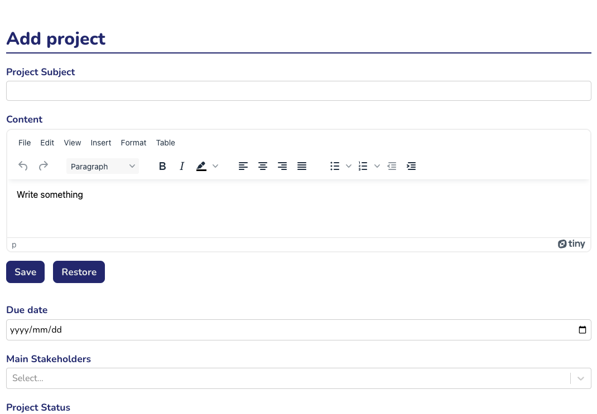
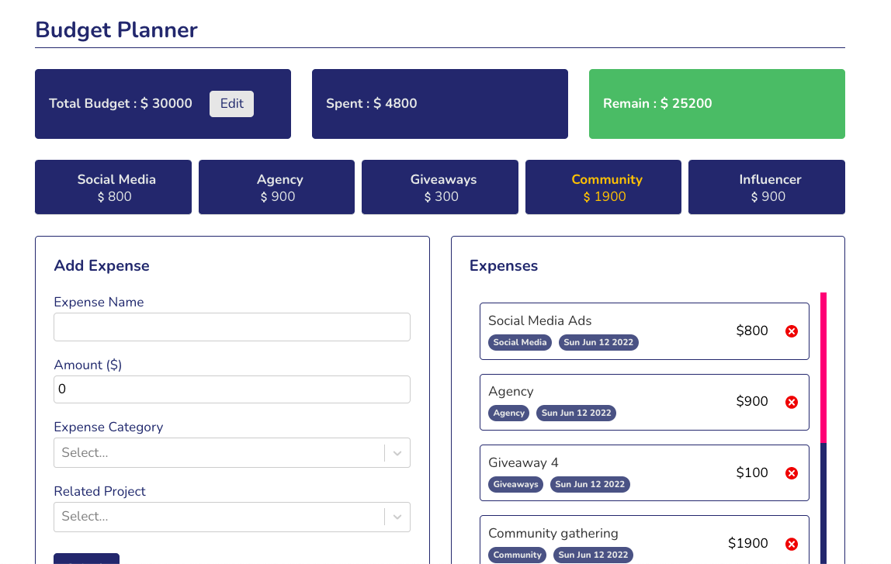
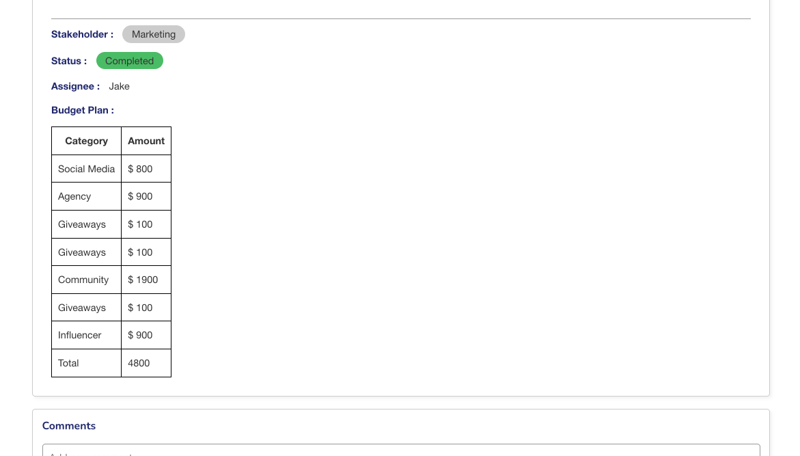

# glance - simplified work space

## Table of contents

- [Description - why](#description---why)
- [Project Description](#project-description)
  - [Demo](#demo)
  - [Tech Stack](#tech-stack)
- [Features](#features)
  - [Authentication](#1-authentication)
  - [Dashboard](#2-dashboard)
  - [Add project](#3-add-project)
  - [Budget Planner](#4-budget-planner)
- [Future Update](#future-update)

## Description - why

I love use all sorts of management tools, simply because I am kinda obsessed with the beauty of each tool has its core idea of how to solve problems.

When I was in my previous company as a marker, we always stored our projects by using gxxxxe drive, we didn't have a space for marketing specifically (something like confluence page, which each department can build its own knowledgebase), therefore, there were lots of scattered documents, let alone to update these files, as for budget planning, we ended up using different sheet to maintain our budget, ever since then the idea of building my own work space has been planted in my mind.

## Project Description

### Demo

- [Live Demo](https://glance-simple-work-space.web.app/)
- [Login with test account](https://glance-simple-work-space.web.app/login)

### Tech stack:

   

| Skill            | Description                                                              |
| :--------------- | :----------------------------------------------------------------------- |
| React Hook       | useState: Adding states to components.                                   |
|                  | useEffect: For fetching data.                                            |
|                  | useRef: Using in custom hook for retrieving data from component.         |
|                  | useHistory: Redirecting user to login page after clicking logout button. |
| Context API      | For authentication                                                       |
| React Router     | Setup pages, e.g. /projects, /projects:id ...                            |
| style-components | Build custom components by writing CSS in JS                             |
| Git              | Version control                                                          |
| webpack          | Module bundler                                                           |
| Babel            | Compiler                                                                 |
| Firebase         | Firestore: Add, update and delete collection / document                  |
|                  | Firebase Authentication: Sign up, login and logout                       |

Third party package:

1. [react-select](https://react-select.com/home)
2. [tinyMCE](https://www.tiny.cloud/docs/tinymce/6/)
3. [scrollReaveal](https://scrollrevealjs.org/)
4. [react-chartjs-2](https://react-chartjs-2.js.org/)

## Features

### 1. Authentication

- By using firebase auth, this allow user to sign up and login.
  

- Landing page with animation.

  

- User can click login button to switch page from signup to login
- User needs to upload a photo, if size of the photo is over 100kb, it will show warning.
  
- Login UI, user can click signup to switch page for signing up.
  

### 2. Dashboard

- Dashboard contains a doughnut chart, project list and a load more button.
- Projects are sorted by due date, the nearest date will be shown first.
  

### 3. Add project

- Here is a from which allow user to add subject, content, due date, stakeholder and assignees.
- I use tinymce as text editor.
- Storing data in localstorage one user click save.
- user can restore content by clicking restore.
- Once clicking submit, project will be shown on the dashboard and the page will be redirect to dashboard.

  

### 4. Budget planner

- This is a simple budget planner, user can change total budget accordingly.
- Once user adds expense, it will render on the dashboard and current page so the user can track every expense.
- All categories are listed out, including amount and for the duplicated category, it will sum up automatically, if the amount is over $ 1500, font color will be yellow.

  

- User can only create project first and add budget to the project belongs to user, only user submit budget to relevant project, it will be shown when use click the project on dashboard.

  

## Future update

1. User can reply in the comment section.
2. Single chatroom
3. Mention functionality and notification.
